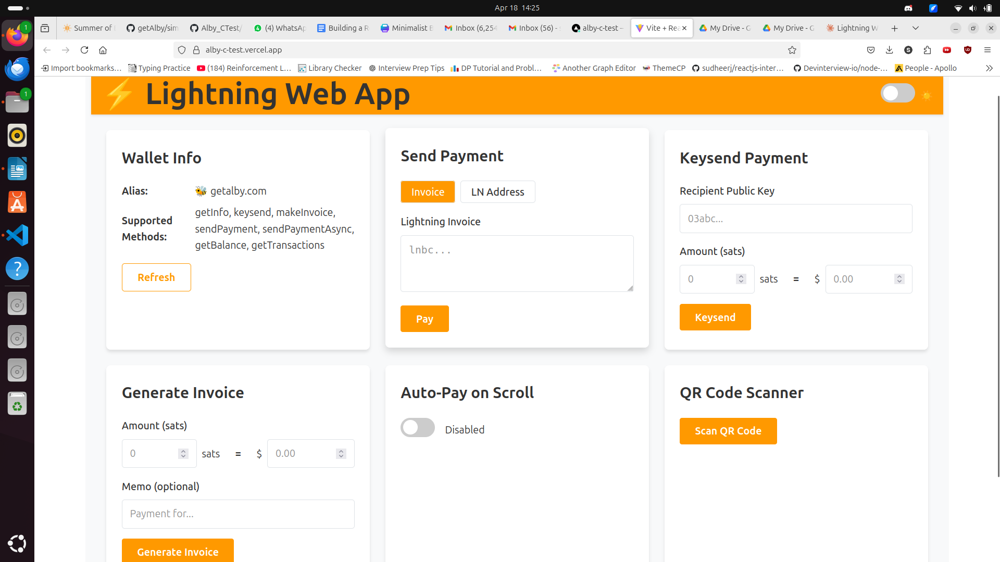

# ⚡ WebLN Lightning Web Application

A comprehensive React-based web application that integrates WebLN to enable Lightning Network functionality directly in the browser. This application demonstrates the core capabilities of WebLN with a modern, responsive user interface.



## Features

### Core WebLN Functionalities
- **Send Payments** - Send Lightning payments using invoices or Lightning addresses
- **Keysend Payments** - Make spontaneous payments directly to node public keys
- **Auto-payment on Scroll** - Trigger micropayments when scrolling through content
- **Wallet Information** - Display connected wallet/node information
- **Invoice Generation** - Create Lightning invoices with customizable amounts and memos
- **LN Address Payments** - Pay to Lightning addresses with automatic resolution

### Technical Features
- **React Functional Components** with Hooks (useState, useEffect)
- **Custom useWebln Hook** for simplified WebLN interactions
- **Responsive Design** that works across devices
- **Dark Mode Support** with persistent user preference
- **QR Code Scanner** for Lightning invoice reading
- **Sats/Fiat Converter** built into payment forms

## Live Demo
[View the Live Demo](https://alby-c-test.vercel.app/)
## Prerequisites
- A WebLN-compatible browser extension like [Alby](https://getalby.com/) or a mobile wallet with WebLN support
- Node.js and npm/yarn for development

## Installation

Clone the repository:
```bash
git clone https://github.com/sahilf637/lightning-app.git
cd lightning-app
```

Install dependencies:
```bash
npm install
# or
yarn install
```

Start the development server:
```bash
npm run dev
# or
yarn dev
```

Build for production:
```bash
npm run build
# or
yarn build
```

## Usage Guide

### Connecting to WebLN
1. Install a WebLN provider (e.g., Alby browser extension)
2. Configure your Lightning wallet in the provider
3. Visit the application and click "Connect WebLN"
4. Approve the connection request in your wallet

### Sending Payments
1. Navigate to the "Send Payment" card
2. Enter a Lightning invoice or choose the LN Address tab
3. For LN addresses, enter the address (e.g., user@domain.com) and amount
4. Click "Pay" to initiate the payment

### Generating Invoices
1. Go to the "Generate Invoice" card
2. Enter the amount in sats (or use the fiat converter)
3. Add an optional memo
4. Click "Generate Invoice" to create a new Lightning invoice

### Using Auto-Pay on Scroll
1. Navigate to the "Auto-Pay on Scroll" card
2. Toggle the feature on
3. Scroll in the designated area to trigger 1 sat micropayments
4. The stats will update to show payment activity

### Scanning QR Codes
1. Go to the "QR Code Scanner" card
2. Click "Scan QR Code" and grant camera permissions
3. Point your camera at a Lightning invoice QR code
4. The app will automatically process the invoice

## Project Structure

```
webln-lightning-app/
├── src/
│   ├── components/
│   │   ├── PaymentForm.jsx          # Send payment component
│   │   ├── KeysendForm.jsx          # Keysend payment component
│   │   ├── WalletInfo.jsx           # Wallet information display
│   │   ├── InvoiceGenerator.jsx     # Invoice creation component
│   │   ├── ScrollPayment.jsx        # Auto-pay on scroll feature
│   │   ├── QRCodeScanner.jsx        # QR code scanner component
│   │   ├── ThemeToggle.jsx          # Dark mode toggle
│   │   └── SatsFiatConverter.jsx    # Sat/fiat conversion component
│   ├── hooks/
│   │   └── useWebln.js              # Custom WebLN hook
│   ├── App.jsx                      # Main application component
│   ├── App.css                      # Application styles
│   └── main.jsx                     # Entry point
├── public/                          # Static assets
├── index.html                       # HTML template
├── vite.config.js                   # Vite configuration
└── package.json                     # Project dependencies
```

## WebLN Resources

- [WebLN Documentation](https://webln.dev/)
- [WebLN GitHub Repository](https://github.com/joule-labs/webln)
- [Alby Browser Extension](https://getalby.com/)
- [Lightning Address Standard](https://lightningaddress.com/)

## Contributing

Contributions are welcome! Please feel free to submit a Pull Request.

1. Fork the repository
2. Create your feature branch (`git checkout -b feature/amazing-feature`)
3. Commit your changes (`git commit -m 'Add some amazing feature'`)
4. Push to the branch (`git push origin feature/amazing-feature`)
5. Open a Pull Request

## Acknowledgments

- [WebLN](https://webln.dev/) for the standardized Lightning API
- [React](https://reactjs.org/) for the UI framework
- [Vite](https://vitejs.dev/) for the build tooling
- [QR Scanner](https://github.com/nimiq/qr-scanner) for QR code functionality
